# 🎥 HabeshaFlix - A Netflix Clone

🎥 HabeshaFlix is a Netflix clone application built using modern web development technologies. It leverages the TMDB (The Movie Database) API for fetching movie and TV show data. The project is structured with a client-side application built with React and Material-UI and a server-side application using Express.js and MongoDB.

## 🔍 Features

🏠 **Home Page:** The home page displays a collection of popular movies, TV shows, and trending content, allowing users to browse and discover new titles.
🔍 **Search:** Users can search for specific movies, TV shows, or actors using the search functionality.
📽️ **Movie/TV Show Details:** Clicking on a movie or TV show will take the user to a detailed page that displays information about the title, including a synopsis, cast details, and related content.
🎬 **Genres:** Users can browse content by specific genres, such as action, comedy, drama, etc.
🔥 **Trending and Popular:** The application provides dedicated sections for trending and popular content, helping users stay up-to-date with the latest and most popular titles.
🔑 **User Authentication:** HabeshaFlix includes user authentication features, allowing users to create an account, log in, and manage their profile.
📋 **Watchlist:** Registered users can add movies and TV shows to their personal watchlist, making it easier to keep track of titles they want to watch in the future.
🎯 **Recommendations:** Based on a user's viewing history and preferences, the application provides personalized recommendations to help them discover new and relevant content.
📱 **Responsive Design:** The application is designed to be responsive and work seamlessly across various devices, including desktops, tablets, and smartphones.

## 🛠️ Technologies Used

### Client-side

- **React.js:** A JavaScript library for building user interfaces.
- **Redux Toolkit:** A comprehensive state management solution for React applications.
- **Material-UI:** A popular React UI framework that provides a set of high-quality React components.
- **Axios:** A promise-based HTTP client for making API requests.
- **React Router Dom:** A routing library for React that enables client-side routing.
- **Formik:** A library for building forms in React.
- **Yup:** A schema validation library used in conjunction with Formik.
- **Swiper:** A modern mobile-touch slider library for React.
- **dayjs:** A lightweight date library that provides a similar API to Moment.js.

### Server-side

- **Express.js:** A web application framework for Node.js that provides a robust set of features for web and mobile applications.
- **Mongoose:** An Object Data Modeling (ODM) library that provides a higher-level abstraction on top of MongoDB.
- **JSON Web Tokens (JWT):** An open standard for securely transmitting information between parties as a JSON object.
- **Axios:** A promise-based HTTP client for making API requests.
- **dotenv:** A zero-dependency module that loads environment variables from a .env file into process.env.
- **express-validator:** A set of express.js middlewares that wraps the validator.js library.


🔥🔥🔥🔥🔥🔥🔥🔥🔥🔥🔥🔥🔥🔥🔥🔥🔥🔥🔥🔥🔥🔥🔥🔥🔥screenshots baby🔥🔥🔥🔥🔥🔥🔥🔥🔥🔥🔥🔥🔥🔥🔥🔥🔥🔥🔥🔥🔥🔥🔥🔥
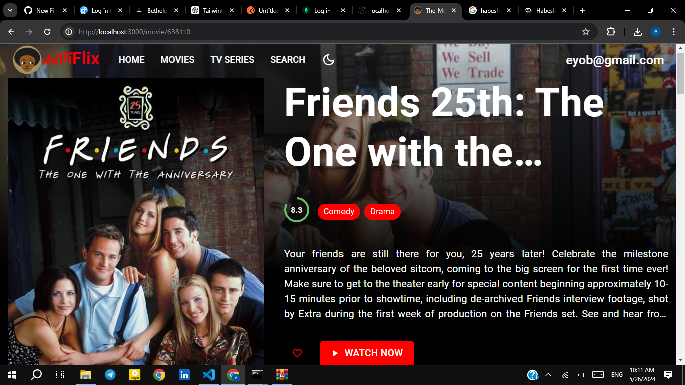
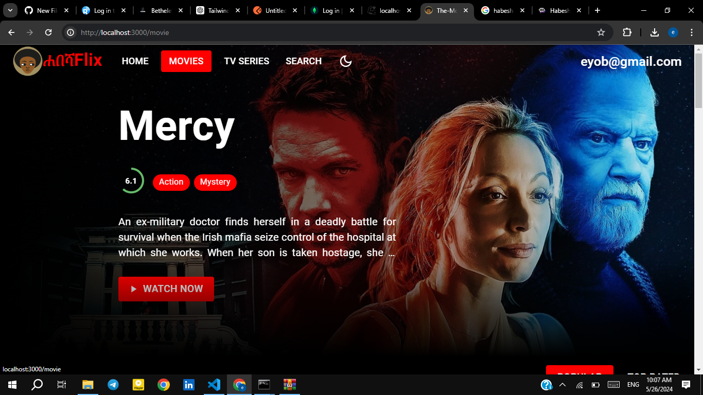
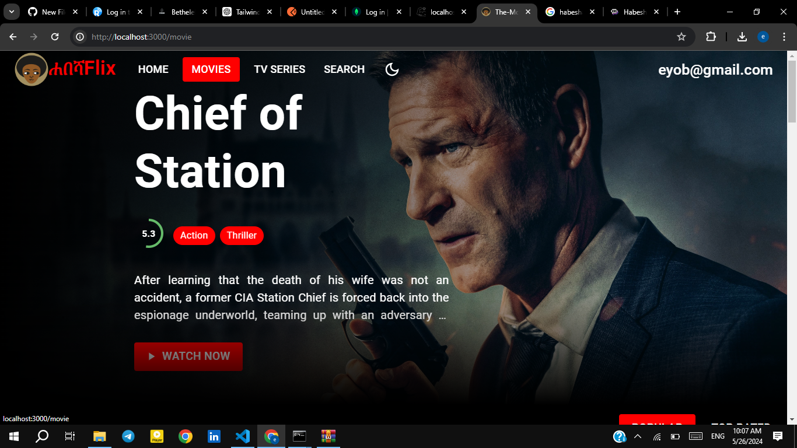
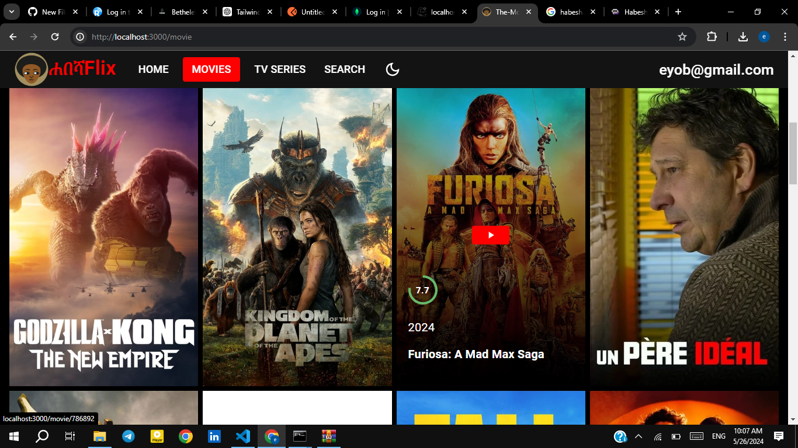
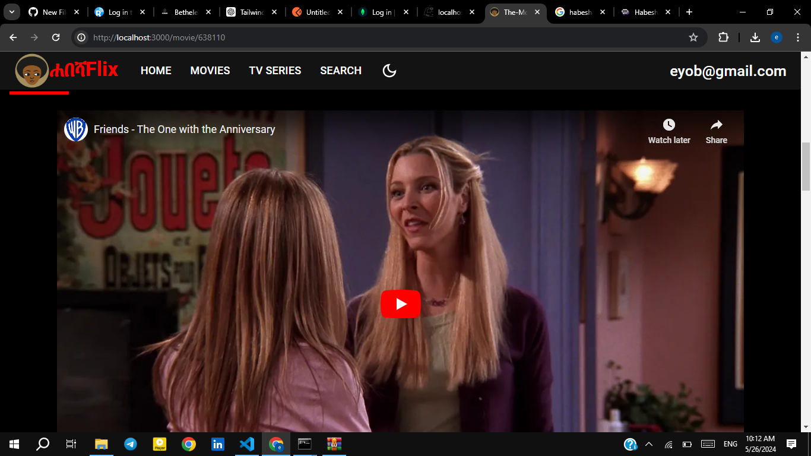
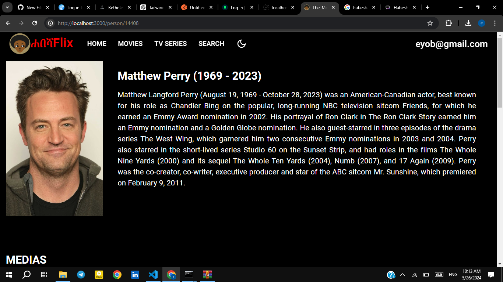
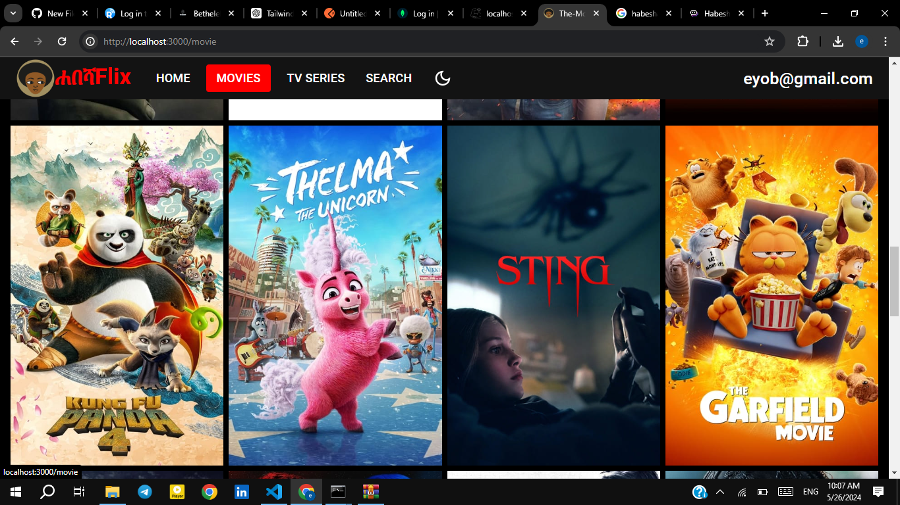
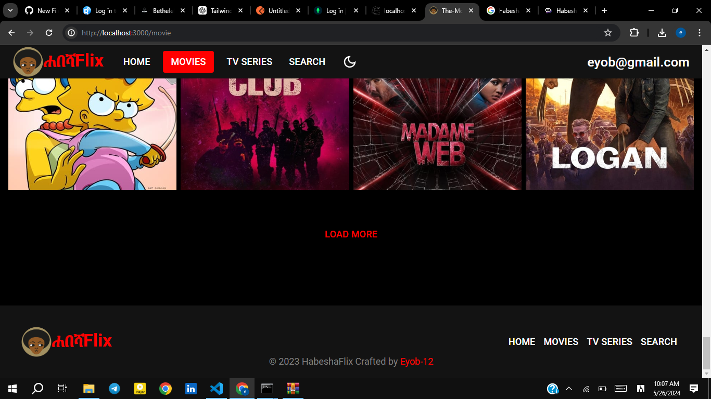
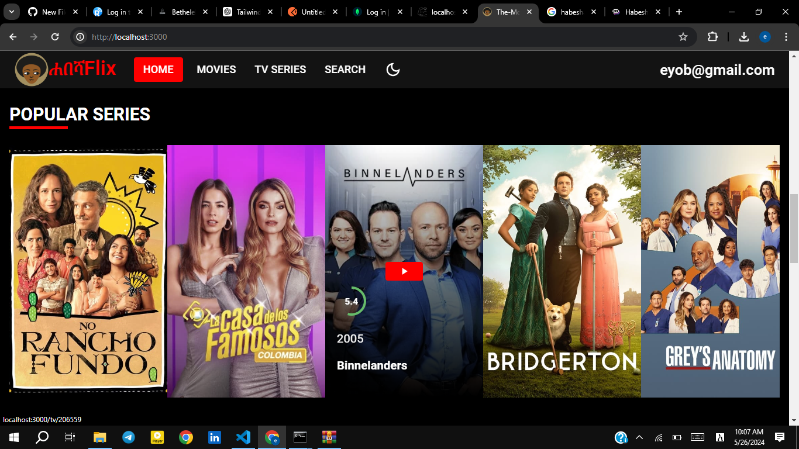
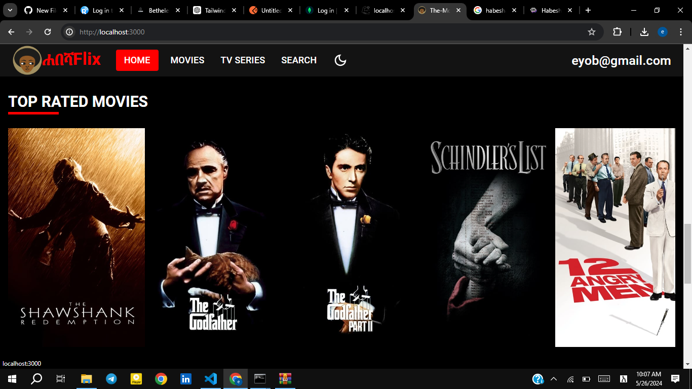
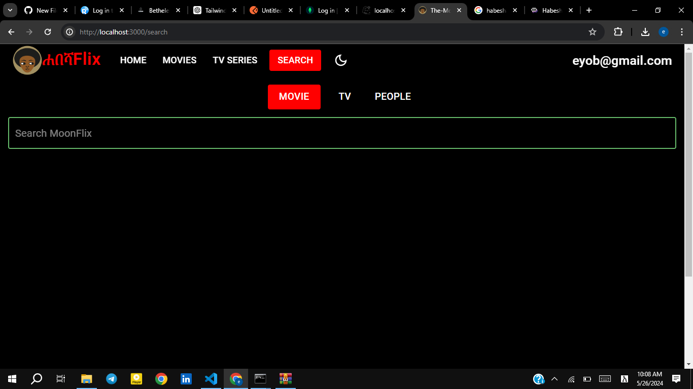

## 🚀 Getting Started

To run the HabeshaFlix application locally, follow these steps:

1. **Clone the repository:**

   ```bash
   git clone https://github.com/eyob-12/Habeshaflix-netflix-clone-using-mern-stack.git

  Install the dependencies:
Client-side: cd The-movies/client && npm install
Server-side: cd The-movies/server && npm install
Set up the environment variables:
Create a .env file in the server directory and add the necessary environment variables (e.g., MongoDB connection string, TMDB API key).
Start the development servers:
Client-side: cd The-movies/client && npm start
Server-side: cd The-movies/server && npm start
Open your web browser and navigate to http://localhost:3000 to access the Habeshaflix application.


